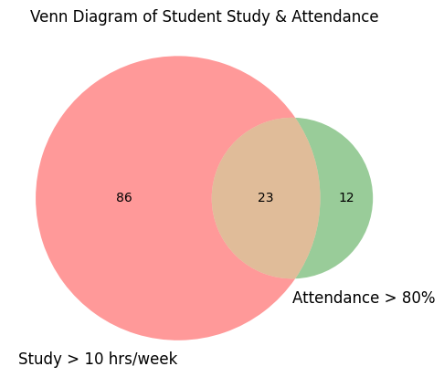

# 📊 Expectation Decider – Probability & Statistics Project 🎯

> **"Turning Data into Decisions using Probability & Statistics"** ✨  

Welcome to the **Expectation Decider** project!  
This repository demonstrates how **probability theory** and **statistical analysis** can be applied to real student data to **predict exam outcomes** and understand **factors influencing success**.

---

## 🚀 Project Overview

This project is part of an **academic case study (PR-2)** where we analyze a dataset of students and apply:

- 📈 Descriptive Statistics  
- 🎲 Probability Theory  
- 🧠 Conditional Probability  
- 🔁 Bayes Theorem  
- 🔵 Venn Diagrams  
- 📊 Contingency Tables  

The final goal is to **decide expectations** about whether a student is likely to **pass a competitive exam**.

---

## 📁 Dataset Information

📄 **Dataset File:**  
➡️ [`dataset.csv`](./dataset.csv)

### 🔍 Dataset Features

| Column Name | Description |
|------------|------------|
| `study_hours` | Hours studied per week |
| `attendance` | Attendance percentage |
| `group_discussion` | Participation (Yes/No) |
| `previous_test_score` | Marks out of 100 |
| `final_exam_pass` | Pass / Fail |

📌 Dataset is **AI-generated** but realistic and suitable for all required probability tasks.

---

## 📓 Jupyter Notebook

🧪 All analysis is performed in:

Includes:
- Step-by-step calculations  
- Markdown explanations (easy English ✨)  
- Tables, diagrams & plots  
- Clean, teacher-friendly logic  

---

## 🧠 Concepts Covered

### 🔹 1. Probability Basics
- What is Probability?
- Key Terminology
- Real-life examples from dataset

### 🔹 2. Types of Probability
- Empirical Probability
- Theoretical Probability

### 🔹 3. Random Variable
- Defined for number of students passing
- Probability Distribution Table
- Mean & Variance

### 🔹 4. Venn Diagram
- Study Hours > 10 ⏱️  
- Attendance > 80% 🏫  
- Overlapping students 🎯  

🖼️ **Venn Diagram Preview:**

---

### 🔹 5. Contingency Table
- Group Discussion vs Final Exam Result
- Joint Probability
- Marginal Probability
- Conditional Probability

---

### 🔹 6. Relationship Between Events
- Independent vs Dependent events
- Intuitive explanation (plain English)

---

### 🔹 7. Bayes Theorem 🧠✨

Used to calculate:

> **P(Pass | High Attendance)**  

Based on historical probabilities:
- High attendance among pass students
- High attendance among fail students
- Overall attendance rate

---

## 🛠️ Tools & Libraries Used

- 🐍 Python  
- 🧮 NumPy  
- 📊 Pandas  
- 📈 Matplotlib  
- 📓 Jupyter Notebook  

---

## 🎯 Key Takeaways

✔️ Higher attendance increases chances of passing  
✔️ Group discussion participation improves outcomes  
✔️ Probability helps **quantify expectations**  
✔️ Bayes theorem refines predictions using prior knowledge  

---

## 👨‍🎓 Author

**Student Name:** _Krisha_  
**Course:** Probability & Statistics  
**Project:** PR-2 – Expectation Decider  

---

## ⭐ Final Note

If you found this project useful or inspiring,  
**don’t forget to ⭐ star the repository!**

Happy Learning 📚✨  

